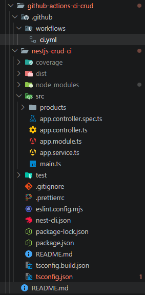
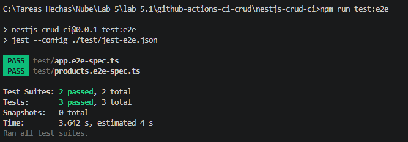
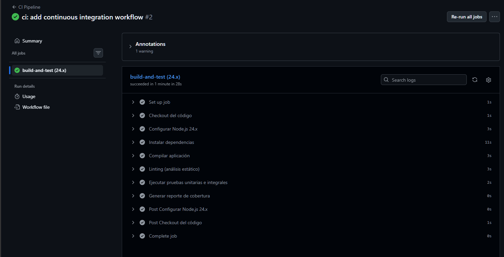
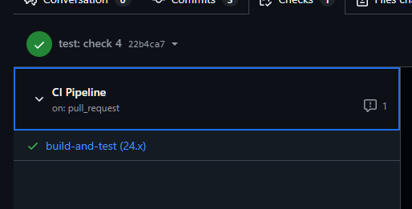
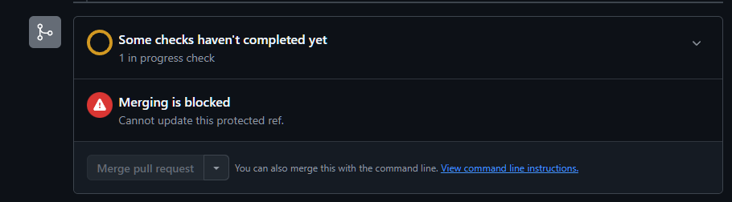
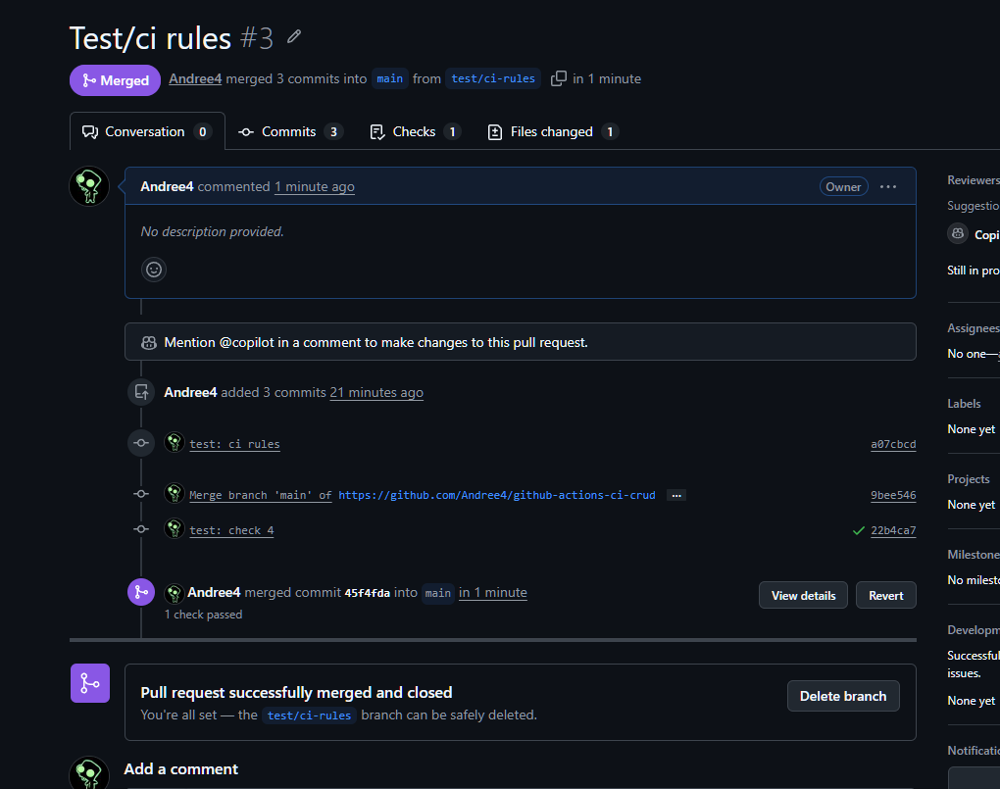
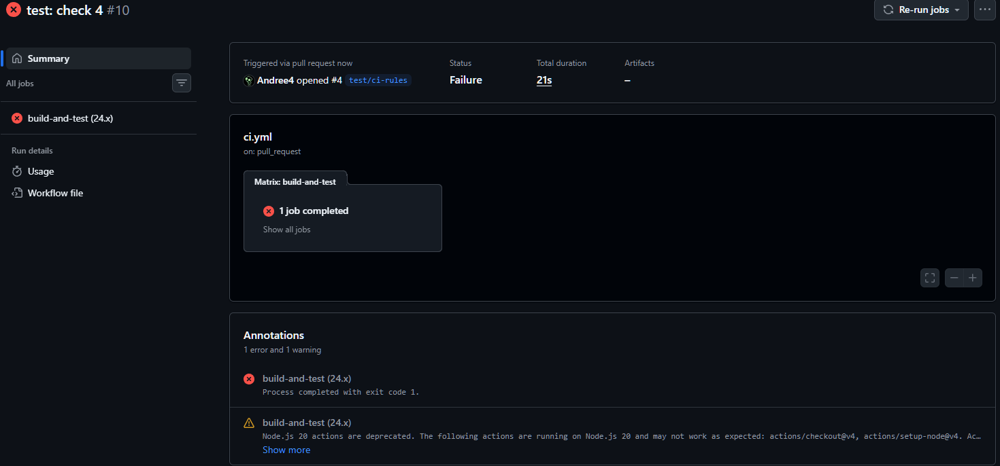
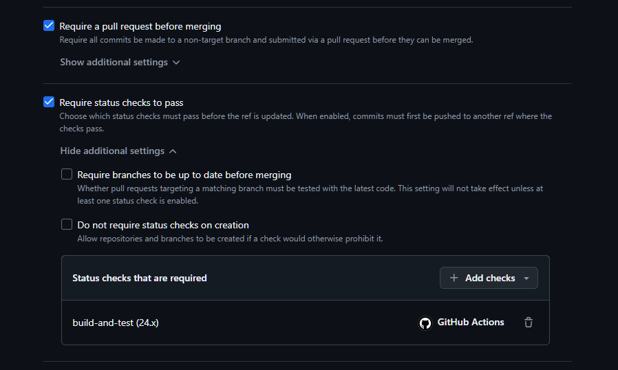

# Laboratorio 5.1: creacion-de-un-workflow-de-github-actions-para-ci

**Alumno:** Daniel Andree Arancibia Aguilar
**Fecha:** 11 de Mayo 2026

---

## **1. Objetivo del Laboratorio**

Implementar un pipeline de **Integración Continua (CI)** para una API REST CRUD desarrollada en **NestJS**, utilizando **GitHub Actions**, con el fin de automatizar la compilación, pruebas y análisis de calidad del código.

---

## **2. Descripción del Proyecto**

El proyecto consiste en una **API RESTful CRUD de Productos** desarrollada con el framework **NestJS**.

El pipeline CI tiene las siguientes responsabilidades:

- Instalar dependencias
- Compilar la aplicación (build)
- Ejecutar linting (análisis estático)
- Ejecutar pruebas unitarias e integrales
- Generar reporte de cobertura de código
- Bloquear merges a `main` si el pipeline falla

---

## **3. Código del Workflow (.github/workflows/ci.yml)**

```yaml
name: CI Pipeline

on:
  push:
    branches: [main]
  pull_request:
    branches: [main]

jobs:
  build-and-test:
    runs-on: ubuntu-latest
    defaults:
      run:
        working-directory: nestjs-crud-ci
    strategy:
      matrix:
        node-version: [24.x]
    steps:
      - name: Checkout del código
        uses: actions/checkout@v4

      - name: Configurar Node.js ${{ matrix.node-version }}
        uses: actions/setup-node@v4
        with:
          node-version: ${{ matrix.node-version }}

      - name: Instalar dependencias
        run: npm ci

      - name: Compilar aplicación
        run: npm run build

      - name: Linting (análisis estático)
        run: npm run lint

      - name: Ejecutar pruebas unitarias e integrales
        run: npm run test -- --coverage

      - name: Generar reporte de cobertura
        if: success()
        run: echo "Workflow completado correctamente."
```

---

## **4. Capturas del laboratorio**

**Estructura del proyecto NestJS**


**Ejecución exitosa de las pruebas**


**Historial de Workflows en GitHub Actions**


**Detalle de Workflow Exitoso**


**Bloqueo de Merge mientras el Workflow está en ejecución**


**Pull Request Mergeada**


**Ejemplo de Workflow Fallido**


**Reglas de Protección de Rama (Branch Protection Rules)**


---

## **5. Conclusiones **

La implementación del pipeline de **Continuous Integration** con GitHub Actions permitió automatizar todo el proceso de verificación de código, garantizando que solo código estable, probado y revisado sea integrado a la rama principal.

**Principales beneficios obtenidos:**

- Detección temprana de errores
- Mantenimiento de estándares de calidad (linting + pruebas)
- Mayor confianza en los merges gracias a las reglas de protección de rama
- Automatización de tareas repetitivas
